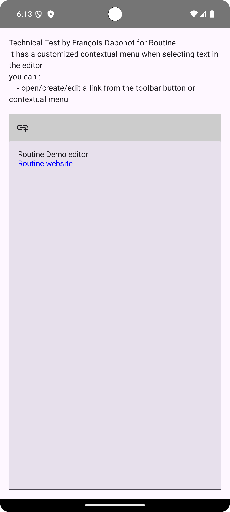
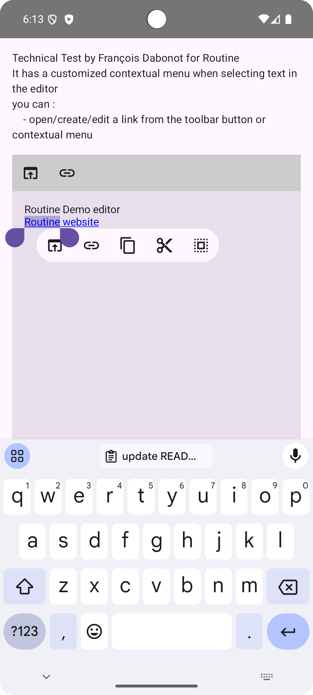
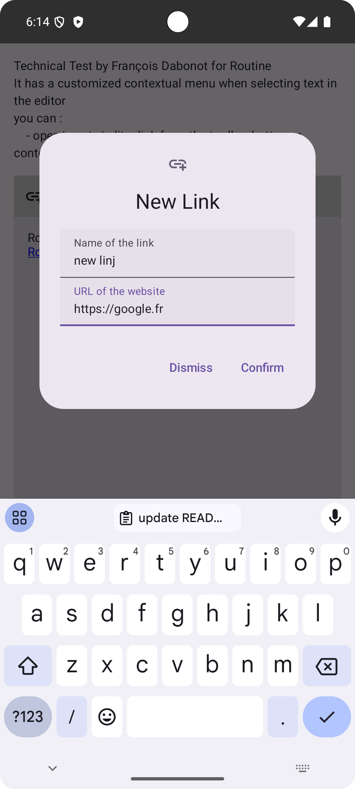

# demo-test-tech

This test uses Compose multiplatform, but it can also work with Compose for Android (as I wanted to make it works on iOS).

Currently, this app can run on iOS, but some gestures are broken and need to be adapted/fixed... it makes the app useless (for now, I Hope).

I have replaced the contextual menu when selecting some text to add more text manipulation than the default one.

The dialog for adding a link could be avoided (and replaced), but it will complicate the code.

Also, there are some edge cases when manipulating the link that need to be debugged.

My advice is to __fork the editor we used and make it your own__.

References :

- [Details of the test](https://routineco.notion.site/Exercise-iOS-Android-links-99dbff03302440ff88d605d50aaeb27b)
- [Entry point of the code](composeApp/src/commonMain/kotlin/fr/francoisdabonot/texttoolbareditordemo/App.kt)
- [Text editor engine](https://github.com/MohamedRejeb/compose-rich-editor)

Some screens

|        |  |
|----------------------------------------|------------------------------------------|
|  |                                          |

